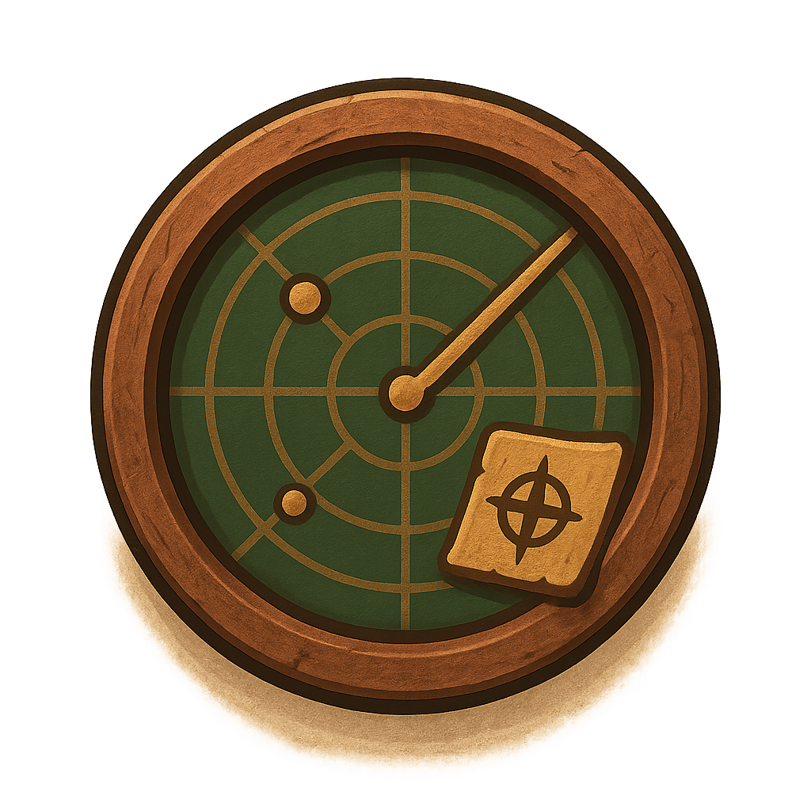
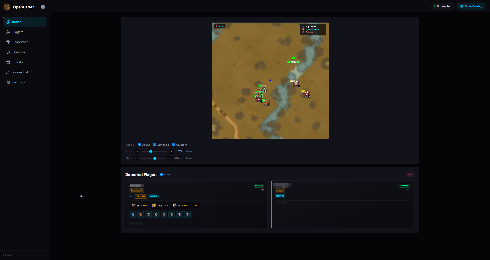
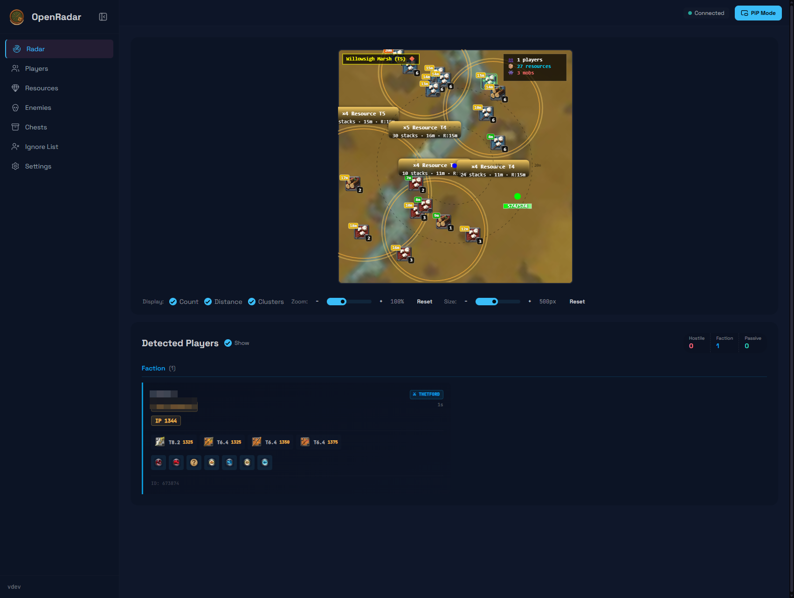
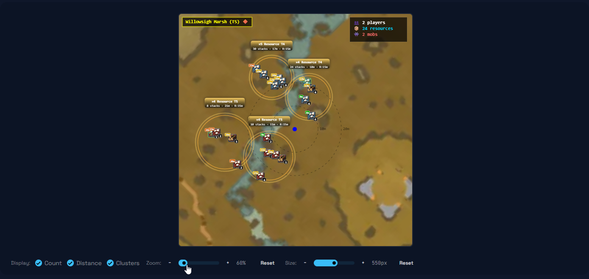
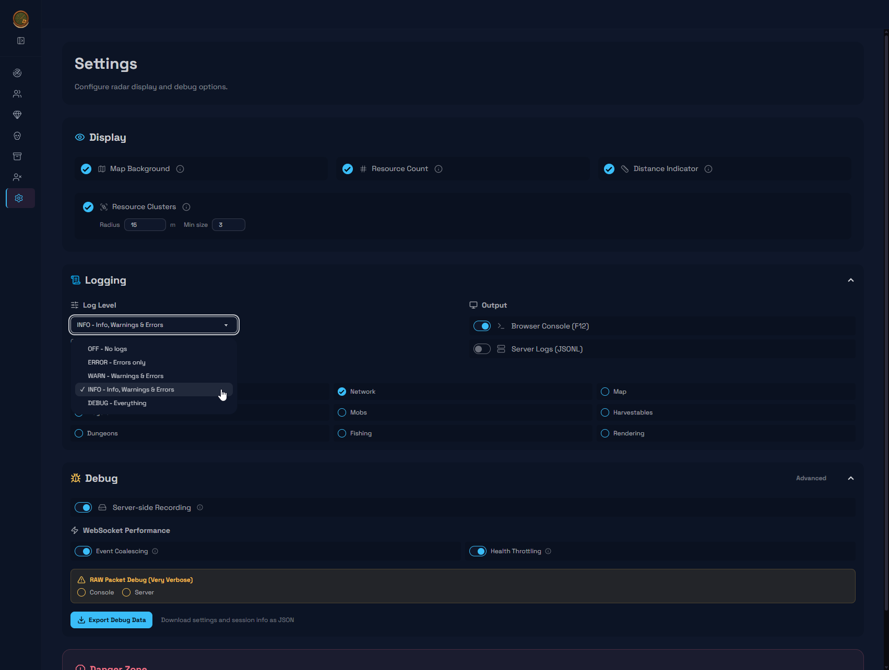
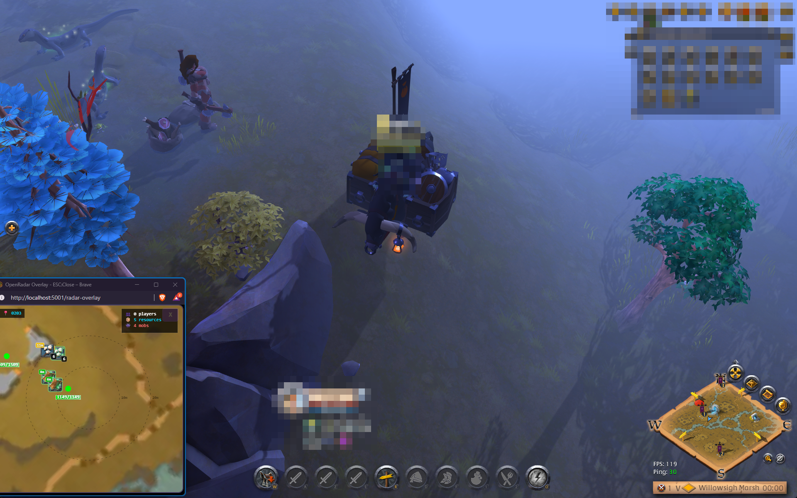
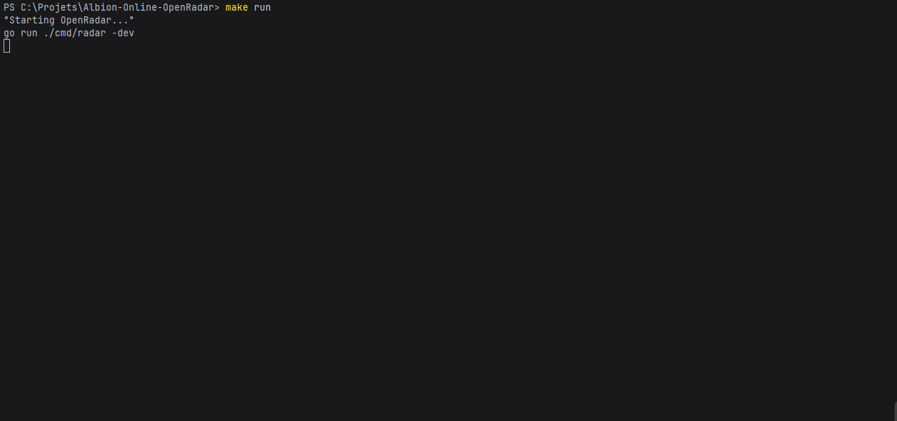

<h1 align="center">
  
  OpenRadar
</h1>

<p align="center">
  <strong>Real-time radar for Albion Online</strong><br>
  <sub>No injection • No risk • Open source</sub>
</p>

<p align="center">
  <a href="https://github.com/Nouuu/Albion-Online-OpenRadar/releases"></a>
  
  
  <a href="https://github.com/Nouuu/Albion-Online-OpenRadar/stargazers"></a>
</p>

<p align="center">
  
</p>

---

## ✨ v2.0 Highlights

<table>
<tr>
<td>

**5x Smaller**<br>
<sub>~95 MB single binary (was 500 MB)</sub>

</td>
<td>

**Instant Start**<br>
<sub>No extraction, no runtime</sub>

</td>
<td>

**Modern UI**<br>
<sub>Tailwind + HTMX + Alpine.js</sub>

</td>
<td>

**Cross-Platform**<br>
<sub>Windows & Linux native</sub>

</td>
</tr>
</table>

### What Changed

```diff
+ Native Go backend (was Node.js)
+ Single port 5001 (was 5001 + 5002)
+ SPA navigation with HTMX (was full reload)
+ 4-layer canvas (was 7 layers)
+ TUI terminal dashboard
+ Dynamic radar sizing (300-800px)
+ Zoom controls (0.5x - 2.0x)
```

### Player Threat Detection

| | Status | Color | Description |
|---|--------|-------|-------------|
| 🟢 | Passive | `#00ff88` | Not flagged for PvP |
| 🟠 | Faction | `#ffa500` | Faction warfare flagged |
| 🔴 | Hostile | `#ff0000` | Hostile (flagged 255) |

> **Alert System**: Screen flash + sound on hostile detection

---

## Screenshots

<table>
  <tr>
    <td></td>
    <td></td>
  </tr>
  <tr>
    <td align="center"><em>Radar with detected entities</em></td>
    <td align="center"><em>Radar with zoom controls</em></td>
  </tr>
  <tr>
    <td></td>
    <td></td>
  </tr>
  <tr>
    <td align="center"><em>Settings page</em></td>
    <td align="center"><em>Resources filtering</em></td>
  </tr>
  <tr>
    <td></td>
    <td></td>
  </tr>
  <tr>
    <td align="center"><em>Floating overlay window</em></td>
    <td align="center"><em>Terminal dashboard (TUI)</em></td>
  </tr>
</table>

---

## Features

### Detection Coverage

| Category | Count | Details |
|----------|-------|---------|
| Resources | 3,698+ | Wood, ore, stone, fiber, hide (T1-T8 + enchants) |
| Mobs | 4,528 | Normal → Enchanted → Mini-Boss → Boss |
| Animals | ~2,800 | Skinnable creatures |
| Dungeons | All | Solo, Group, Corrupted, Mists |
| Chests | All | Common → Uncommon → Rare → Legendary |

### Radar Controls

| Feature | Description |
|---------|-------------|
| Size | 300px - 800px adjustable |
| Zoom | 0.5x - 2.0x magnification |
| Rings | Distance at 10m/20m intervals |
| Zone | Current zone + Black Zone warning |
| Stats | Player/resource/mob counts |
| Threat | Red pulse border on hostile |
| Overlay | Floating window mode |

---

## 🚀 Quick Start

<table>
<tr>
<td width="50%">

### Windows

1. Install **[Npcap 1.84+](https://npcap.com/dist/npcap-1.84.exe)**
2. Download from **[Releases](https://github.com/Nouuu/Albion-Online-OpenRadar/releases)**
3. Run `OpenRadar.exe`
4. Select network adapter
5. Open **http://localhost:5001**

</td>
<td width="50%">

### Linux

```bash
# Install libpcap
sudo apt install libpcap0.8  # Debian/Ubuntu

# Grant permissions & run
sudo setcap cap_net_raw=eip ./OpenRadar-linux
./OpenRadar-linux
```

</td>
</tr>
</table>

```bash
# CLI Options
OpenRadar -version       # Show version
OpenRadar -ip X.X.X.X    # Skip adapter selection
OpenRadar -dev           # Development mode
```

---

## 🛠 For Developers

### Prerequisites

| Tool | Version | Notes |
|------|---------|-------|
| Go | 1.25+ | [Download](https://go.dev/dl/) |
| Npcap | 1.84+ | Windows only |
| libpcap | Latest | Linux only |
| Node.js | 20+ | Build scripts only |
| Docker | Latest | Linux cross-compile |

### Quick Setup

```bash
git clone https://github.com/Nouuu/Albion-Online-OpenRadar.git
cd Albion-Online-OpenRadar

make install-tools  # Install Air (hot-reload)
make dev            # Start dev server
```

### Build Commands

```bash
make build-win    # Windows executable
make build-linux  # Linux via Docker
make build-all    # All platforms
make all-in-one   # Full release workflow
```

<details>
<summary>Project Structure</summary>

```
OpenRadar/
├── cmd/radar/        # Go entry point
├── internal/         # Go packages
│   ├── capture/      # Packet capture (pcap)
│   ├── photon/       # Protocol parsing
│   ├── server/       # HTTP & WebSocket
│   ├── templates/    # Go templates (SSR)
│   └── logger/       # Structured logging
├── web/              # Frontend (embedded)
│   ├── images/
│   ├── scripts/      # JavaScript modules
│   └── sounds/
├── tools/            # Build scripts (Node.js)
└── Makefile
```

</details>

---

## 📖 Documentation

| Guide | Description |
|-------|-------------|
| [RELEASE_NOTES.md](RELEASE_NOTES.md) | Version 2.0 changes |
| [DEV_GUIDE.md](docs/dev/DEV_GUIDE.md) | Development guide |
| [docs/](docs/) | Full documentation |

---

## Contributing

1. Fork the repository
2. Create feature branch (`git checkout -b feature/amazing`)
3. Commit changes (`git commit -m 'feat: add amazing'`)
4. Push (`git push origin feature/amazing`)
5. Open Pull Request

---

## Credits

**Maintainer**: [@Nouuu](https://github.com/Nouuu)

**Based on**: [ZQRadar](https://github.com/Zeldruck/Albion-Online-ZQRadar) by [@Zeldruck](https://github.com/Zeldruck)

---

<p align="center">
  <sub>⚠️ Educational purposes only. Use at your own risk.</sub>
</p>