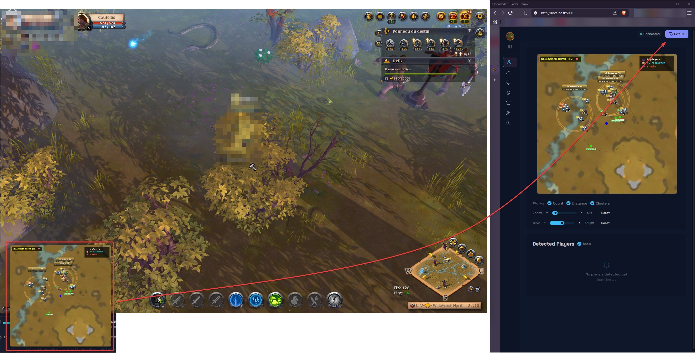

<h1 align="center">
  
  OpenRadar
</h1>

<p align="center">
  <strong>Real-time radar for Albion Online</strong><br>
  <sub>Passive network capture • Zero injection • Open source</sub>
</p>

<p align="center">
  <a href="https://github.com/Nouuu/Albion-Online-OpenRadar/releases">
    
  </a>
  
  
  <a href="https://github.com/Nouuu/Albion-Online-OpenRadar/stargazers">
    
  </a>
</p>

https://github.com/user-attachments/assets/33fe1ac7-11f2-4c3c-a91c-0ab42ebdda7d

---

Tired of farming blind in the Black Zone? OpenRadar shows you resources, mobs, and players around you, right in your
browser.

**How does it work?** The app listens to network traffic between your PC and Albion's servers, decodes the Photon
protocol, and displays everything on a web-based radar. No client modification, no memory injection. Just passive
reading.

---

## Quick Start

### Windows

1. Install **[Npcap](https://npcap.com/#download)** (required for packet capture)
2. Download `OpenRadar-windows-amd64.exe` from [Releases](https://github.com/Nouuu/Albion-Online-OpenRadar/releases)
3. Run it, pick your network adapter
4. Open **http://localhost:5001** in your browser
5. Launch Albion and start playing

### Linux

```bash
# Install libpcap
sudo apt install libpcap0.8  # Debian/Ubuntu

# Download and set permissions
chmod +x OpenRadar-linux-amd64
sudo setcap cap_net_raw=eip ./OpenRadar-linux-amd64

# Run
./OpenRadar-linux-amd64
```

### CLI Options

```bash
OpenRadar -version       # Show version
OpenRadar -ip X.X.X.X    # Skip adapter selection
OpenRadar -dev           # Development mode (read files from disk)
```

---

## What It Detects

### Production-Ready

| What          | Coverage                                                                                          |
|---------------|---------------------------------------------------------------------------------------------------|
| **Resources** | 3,698 nodes validated. T1-T8, enchanted (.1 .2 .3), static and skinnable                          |
| **Mobs**      | 4,528 catalogued. Color-coded: green (normal), purple (enchanted), orange (mini-boss), red (boss) |
| **Players**   | Faction flags, hostile detection, zone-aware alerts                                               |
| **Zones**     | 1,000+ zones mapped. Safe/Yellow/Red/Black detection drives threat logic                          |

### Player Threat Detection

| Status  | Color     | Description             |
|---------|-----------|-------------------------|
| Passive | `#00ff88` | Not flagged for PvP     |
| Faction | `#ffa500` | Faction warfare flagged |
| Hostile | `#ff0000` | Hostile (flagged 255)   |

> **Alert System**: Screen flash + sound on hostile detection

### Basic (Legacy)

Dungeons and chests are detected but not yet refactored. Coming in v2.2:

- **Dungeons**: Solo, Group, Corrupted, Hellgate entrances show on radar
- **Chests**: Loot chests visible, rarity classification planned

---

## Radar Controls

| Feature | Description                              |
|---------|------------------------------------------|
| Size    | 300px - 800px adjustable                 |
| Zoom    | 0.5x - 2.0x magnification                |
| Rings   | Distance indicators at 10m/20m intervals |
| Zone    | Current zone name + PvP type indicator   |
| Stats   | Player/resource/mob counts               |
| Threat  | Red pulse border on hostile detection    |
| PiP     | Picture-in-Picture floating window       |

---

## Features

### Picture-in-Picture

Playing fullscreen? Pop the radar into a floating window that stays on top. Native browser PiP, one click.

### Zone-Aware Alerts

The radar knows where you are. Safe zone? Quiet. Black Zone? Every player is a threat. Visual flash + audio alert when
hostiles appear.

### Self-Contained

Fonts, icons, everything bundled. Once Albion connects, the radar works without internet.

### Roadmap

Check [TODO.md](docs/project/TODO.md) for what's coming:

- v2.2: Dungeons, Chests, Mists, Fishing refactoring
- Future: Native desktop app (Wails v3), squad mode, session heatmaps

---

## Screenshots

<table>
  <tr>
    <td></td>
    <td></td>
  </tr>
  <tr>
    <td align="center"><em>Main radar view</em></td>
    <td align="center"><em>Detecting resources and mobs</em></td>
  </tr>
  <tr>
    <td></td>
    <td></td>
  </tr>
  <tr>
    <td align="center"><em>Zoom controls</em></td>
    <td align="center"><em>PiP floating window</em></td>
  </tr>
  <tr>
    <td></td>
    <td></td>
  </tr>
  <tr>
    <td align="center"><em>Settings page</em></td>
    <td align="center"><em>Resource filtering</em></td>
  </tr>
  <tr>
    <td colspan="2" align="center"></td>
  </tr>
  <tr>
    <td colspan="2" align="center"><em>Terminal dashboard (TUI)</em></td>
  </tr>
</table>

---

## What's New in v2.1

This release is all about polish. Memory leaks hunted down, every frame squeezed, the whole thing feels snappier.

### Performance

| Before               | After         |           |
|----------------------|---------------|-----------|
| 4 GB RAM after 30min | 500 MB stable | **-87%**  |
| 1200 MB heap         | 20 MB heap    | **-98%**  |
| 30-60 FPS            | 160+ FPS      | **+170%** |
| 80ms GC pauses       | 12ms          | **-85%**  |

Event listener leaks fixed, LRU caching for images, server-side WebSocket batching, client-side event coalescing. The
radar now runs for hours without degradation.

### UX Improvements

- **SPA navigation**: No more page reloads. Click around, everything stays smooth
- **PiP mode**: Native browser Picture-in-Picture, stays on top of your game
- **Zone indicators**: See at a glance if you're in safe, yellow, red, or black zone
- **Smarter alerts**: Only warns when there's actual danger
- **Settings persistence**: Config survives refresh and navigation

### Under the Hood

- PageController orchestrates init/destroy cycles, no more orphan listeners
- WebSocketManager with auto-reconnect and visibility handling
- Image cache with LRU eviction (bye bye memory bloat)
- Server-side event batching every 16ms
- Client-side event coalescing for Move/Health updates
- All CDN dependencies removed (fonts, icons, HTMX bundled locally)

### Smaller Binary

Asset optimization cuts embedded data massively:

| Asset      | Before | After  | Reduction |
|------------|--------|--------|-----------|
| Game data  | 130 MB | 2.3 MB | **-98%**  |
| Maps       | 50 MB  | ~25 MB | -50%      |
| Item icons | 27 MB  | ~17 MB | -37%      |

The 84 MB localization file? Gone. Minified JSONs keep only what the radar needs.

**Total embedded: ~210 MB → ~45 MB**

---

## For Developers

### Requirements

| Tool    | Version | Notes                  |
|---------|---------|------------------------|
| Go      | 1.25+   | Backend                |
| Npcap   | 1.84+   | Windows packet capture 
| libpcap | Latest  | Linux packet capture   |
| Node.js | 20+     | Build scripts only     |
| Docker  | Latest  | Linux cross-compile    |

### Quick Start

```bash
git clone https://github.com/Nouuu/Albion-Online-OpenRadar.git
cd Albion-Online-OpenRadar

make run   # Run directly
# or
make dev   # Run with hot-reload (requires: make install-tools)
```

### Build

```bash
make build-win        # Windows binary
make build-linux      # Linux binary (via Docker)
make release-snapshot # Full release build (both platforms)
```

### Project Structure

```
├── cmd/radar/        # Entry point + TUI
├── internal/         # Go packages
│   ├── capture/      # Packet capture (pcap)
│   ├── photon/       # Protocol parsing
│   ├── server/       # HTTP + WebSocket
│   └── templates/    # Go templates (.gohtml)
├── web/              # Frontend (embedded in binary)
│   ├── scripts/      # JavaScript modules
│   ├── images/       # Maps, items, spells icons
│   └── ao-bin-dumps/ # Game data (minified)
├── tools/            # Build & data scripts (Node.js)
└── docs/             # Documentation
```

---

## Documentation

| Guide                                              | Description         |
|----------------------------------------------------|---------------------|
| [DEV_GUIDE.md](docs/dev/DEV_GUIDE.md)              | Development setup   |
| [RELEASE_2.0.0.md](docs/releases/RELEASE_2.0.0.md) | Version 2.0 changes |
| [TODO.md](docs/project/TODO.md)                    | Roadmap             |
| [docs/](docs/)                                     | Full documentation  |

---

## Known Limitations

- **Player positions**: Albion encrypts movement data. Players are detected but can't be shown on radar.
- **Some Black Zone maps**: Tiles for zone IDs 4000+ missing. Disable map background in settings as workaround.
- **Resource charges**: May differ from actual due to server-side harvest bonuses.

---

## Contributing

Found a bug? Want to help? [Open an issue](https://github.com/Nouuu/Albion-Online-OpenRadar/issues) or submit a PR.

---

## Credits

Built by [@Nouuu](https://github.com/Nouuu)

Based on [ZQRadar](https://github.com/Zeldruck/Albion-Online-ZQRadar) by [@Zeldruck](https://github.com/Zeldruck)

---

<p align="center">
  <sub>⚠️ For educational purposes. Use at your own risk.</sub>
</p>
