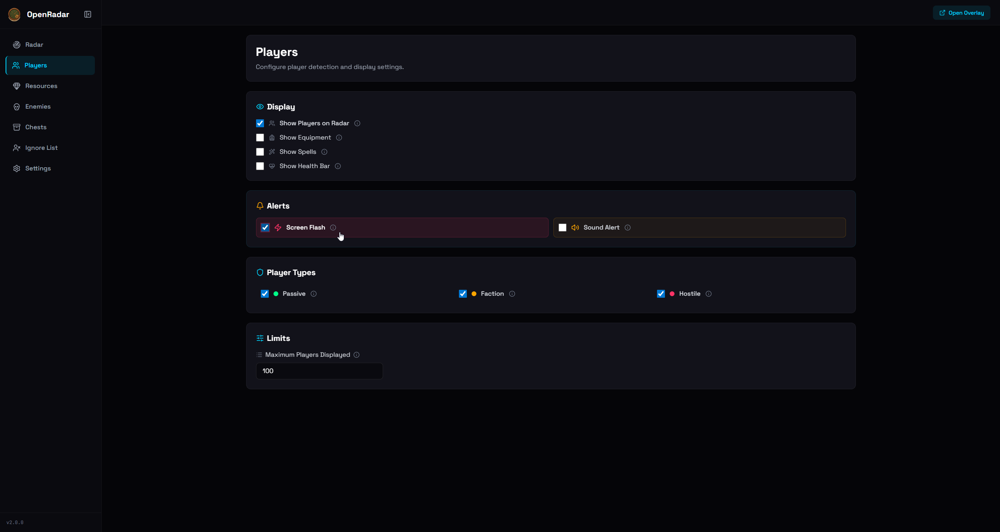
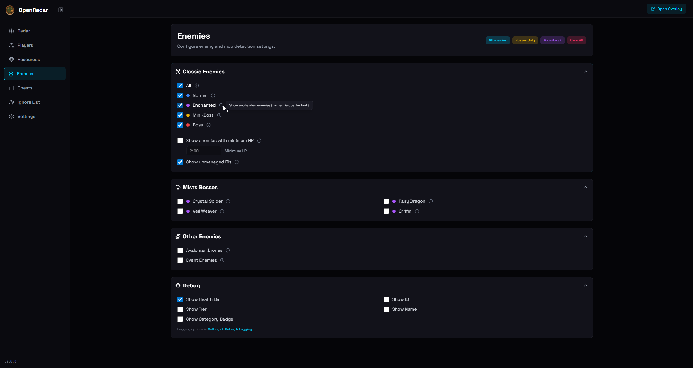

# OpenRadar v2.0 - Screenshots & Assets

## TUI Dashboard

  

Terminal dashboard with Bubble Tea showing real-time stats (packets, WS clients, memory, goroutines) and log output.

---

## Radar Views

<table>
  <tr>
    <td></td>
    <td></td>
  </tr>
  <tr>
    <td align="center"><em>Main radar view</em></td>
    <td align="center"><em>Radar with detected entities</em></td>
  </tr>
  <tr>
    <td colspan="2" align="center"></td>
  </tr>
  <tr>
    <td colspan="2" align="center"><em>Radar with zoom and size controls</em></td>
  </tr>
</table>

---

## Overlay Window

  

Floating transparent radar window for multi-monitor setups.

---

## Settings Pages

<table>
  <tr>
    <td></td>
    <td></td>
  </tr>
  <tr>
    <td align="center"><em>General settings</em></td>
    <td align="center"><em>Players settings</em></td>
  </tr>
  <tr>
    <td></td>
    <td></td>
  </tr>
  <tr>
    <td align="center"><em>Resources filtering</em></td>
    <td align="center"><em>Enemies filtering</em></td>
  </tr>
  <tr>
    <td colspan="2" align="center"></td>
  </tr>
  <tr>
    <td colspan="2" align="center"><em>Chests & dungeons settings</em></td>
  </tr>
</table>

---

## File List

| File | Description |
|------|-------------|
| `OpenRadar.gif` | TUI dashboard animation |
| `radar_1.png` | Main radar view |
| `radar_2.png` | Radar with entities |
| `radar_3.png` | Radar zoomed |
| `overlay.png` | Floating overlay window |
| `settings.png` | General settings page |
| `players.png` | Players settings |
| `resources.png` | Resources settings |
| `ennemies.png` | Enemies settings |
| `chest & dungeon.png` | Chests & dungeons settings |