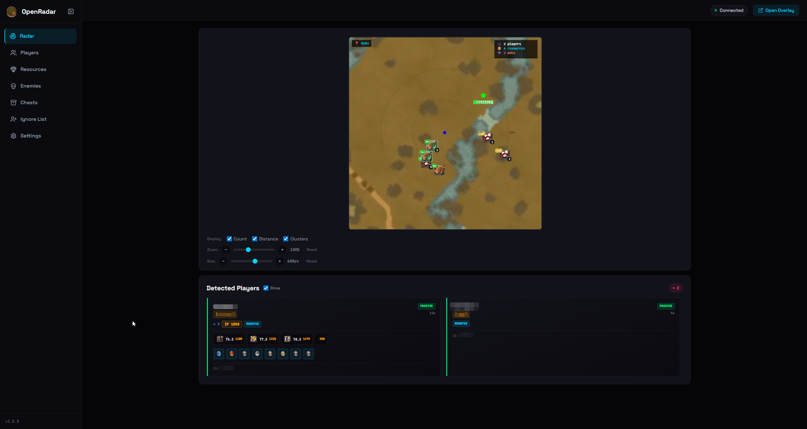
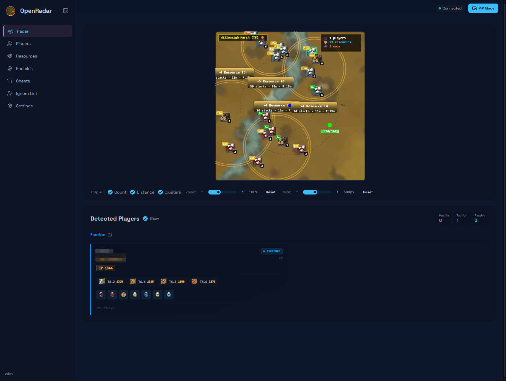
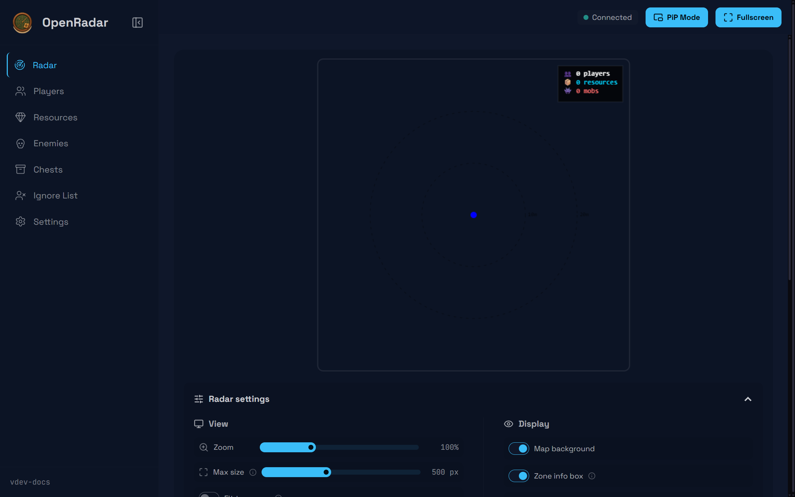
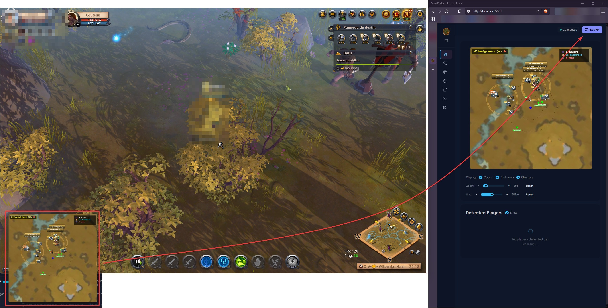
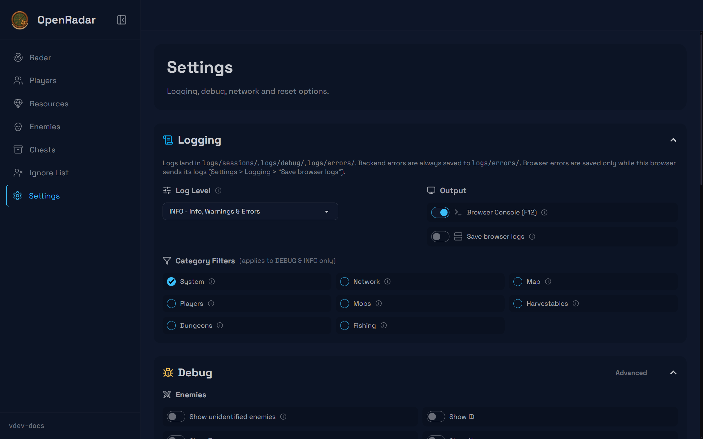
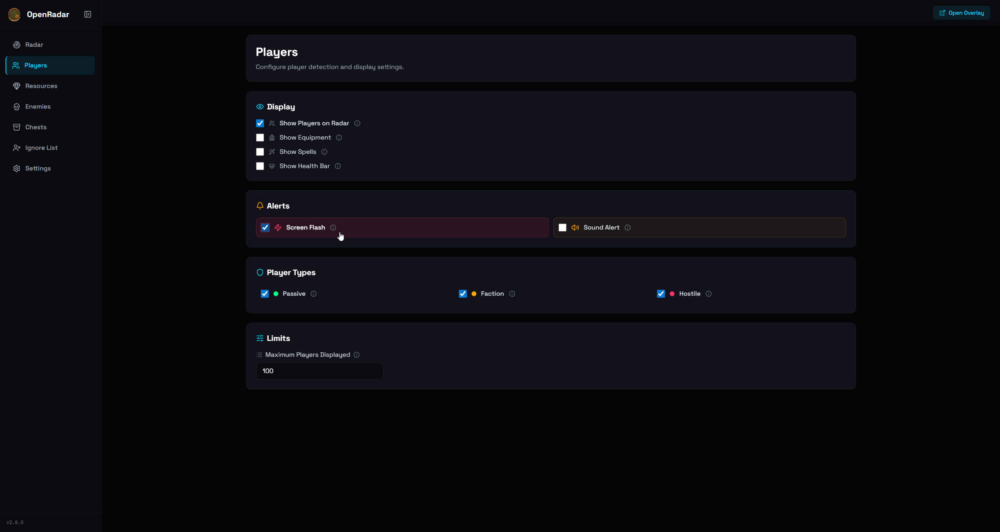
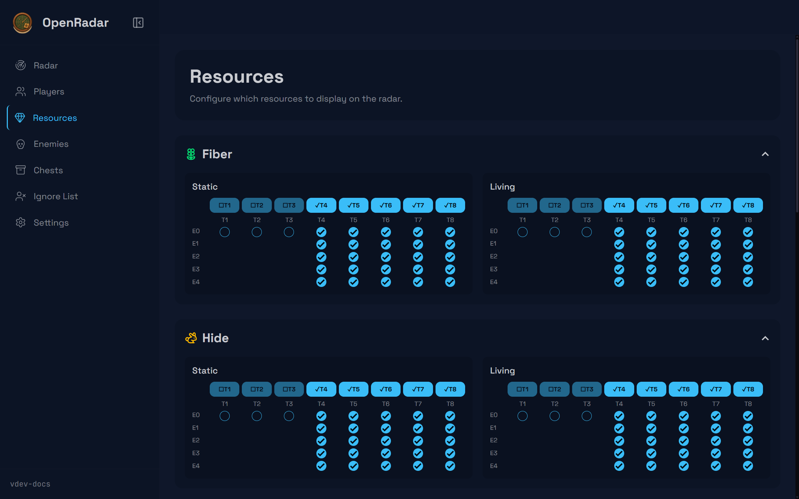
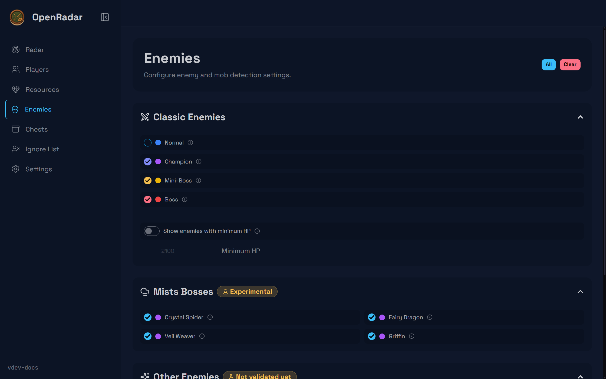
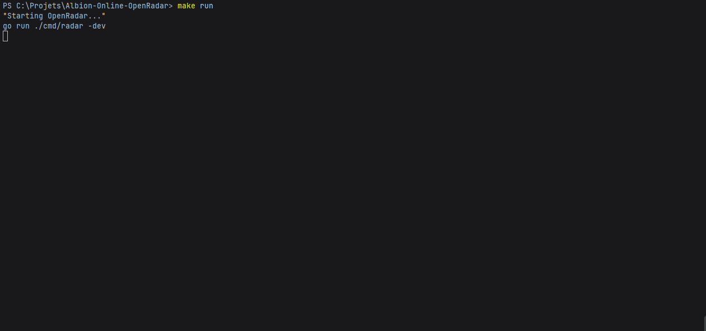

# Screenshots and assets

Images used by the main README and the release notes.

## Radar

<table>
  <tr>
    <td></td>
    <td></td>
  </tr>
  <tr>
    <td align="center"><em>Main radar view</em></td>
    <td align="center"><em>Radar with detected entities</em></td>
  </tr>
  <tr>
    <td></td>
    <td></td>
  </tr>
  <tr>
    <td align="center"><em>Zoom and size controls</em></td>
    <td align="center"><em>Picture-in-Picture window</em></td>
  </tr>
</table>

## Settings

<table>
  <tr>
    <td></td>
    <td></td>
  </tr>
  <tr>
    <td align="center"><em>General settings</em></td>
    <td align="center"><em>Players settings</em></td>
  </tr>
  <tr>
    <td></td>
    <td></td>
  </tr>
  <tr>
    <td align="center"><em>Resource filtering</em></td>
    <td align="center"><em>Enemy filtering</em></td>
  </tr>
  <tr>
    <td colspan="2" align="center"></td>
  </tr>
  <tr>
    <td colspan="2" align="center"><em>Chests and dungeons settings</em></td>
  </tr>
</table>

## Terminal dashboard

  

Bubble Tea dashboard: packets, WebSocket clients, memory, goroutines, live log tail.

## File list

| File | Used by |
|---|---|
| `OpenRadar.gif` | TUI dashboard animation |
| `radar_1.png` | main radar view |
| `radar_2.png` | radar with entities |
| `radar_3.png` | radar zoomed |
| `pip.jpg` | Picture-in-Picture window |
| `settings.png` | general settings page |
| `players.png` | players settings |
| `resources.png` | resources settings |
| `ennemies.png` | enemies settings |
| `chest & dungeon.png` | chests and dungeons settings |
| `exitlag.png` | ExitLag NDIS setting, main README |
| `overlay.png` | legacy, the Wails-era floating window. Replaced by Picture-in-Picture |
